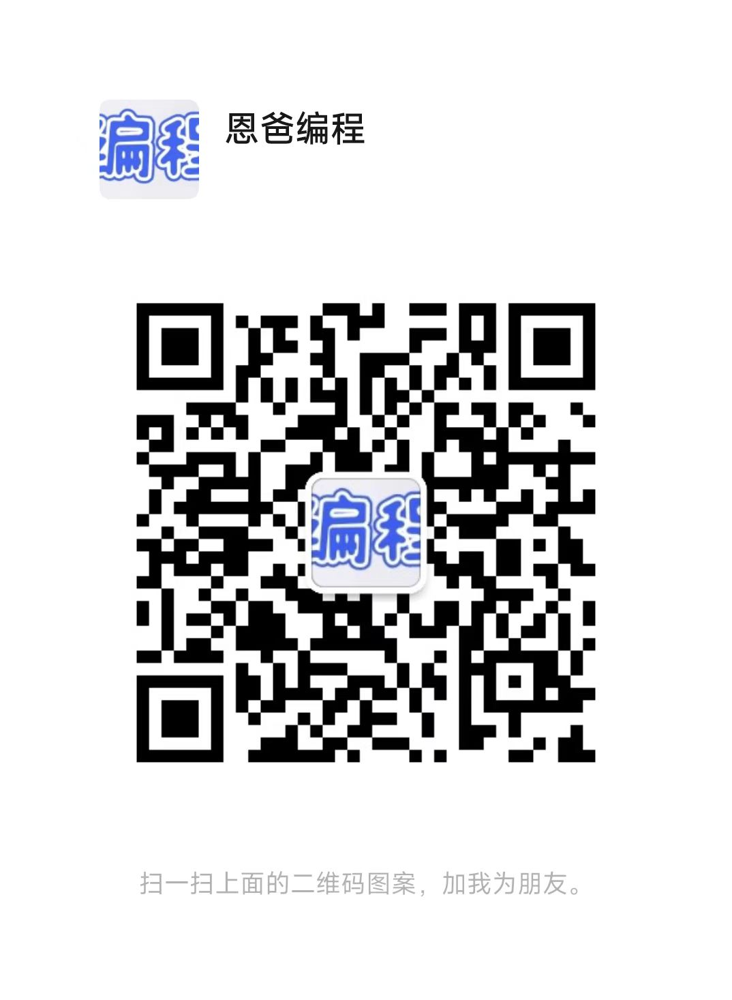

### 微信Native支付

[产品介绍](https://pay.weixin.qq.com/docs/merchant/products/native-payment/introduction.html)

[接入前准备](https://pay.weixin.qq.com/docs/merchant/products/native-payment/preparation.html)

[开发指引](https://pay.weixin.qq.com/docs/merchant/products/native-payment/development.html)

[API列表](https://pay.weixin.qq.com/docs/merchant/products/native-payment/apilist.html)

[支付通知](https://pay.weixin.qq.com/docs/merchant/apis/native-payment/payment-notice.html)

[开发者社区](https://developers.weixin.qq.com/community/pay)

**整体原则就是按照官方文档一步一步来**

---

支付产品

微信认证

**注意：只有服务号才能对接微信支付。每年都需要花300块认证费用。**

---

**任何疑问添加微信咨询**
